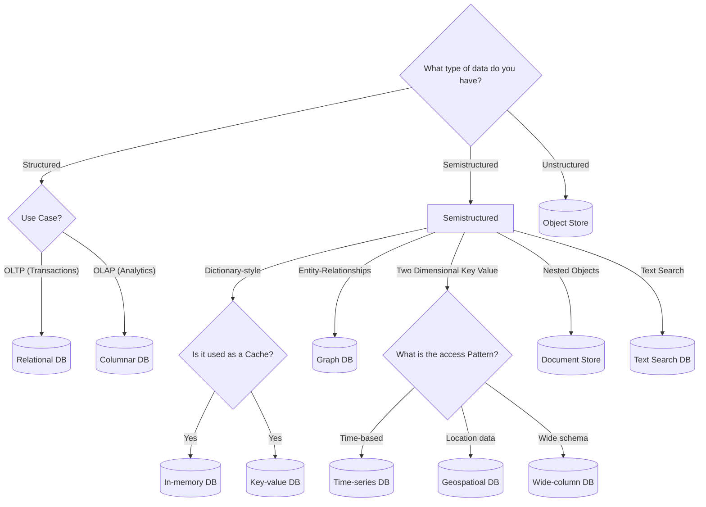

## Solution Designs

# Choosing a DB

```mermaid
flowchart TD
    A{What type of data do you have?} --> |Structured| B{Use Case?}
    A --> |Semistructured| C[Semistructured]
    A --> |Unstructured| D[Object Store]@{ shape: db }
    B --> |"OLTP (Transactions)"| E[Relational DB]@{shape: db}
    B --> |"OLAP (Analytics)"| F[Columnar DB]@{shape: db}
    C --> |Dictionary-style| G{Is it used as a Cache?}
    G --> |Yes| H[In-memory DB]@{shape: db}
    G --> |Yes| I[Key-value DB]@{shape: db}
    C --> |Entity-Relationships| J[Graph DB]@{shape: db}
    C --> |Two Dimensional Key Value| K{What is the access Pattern?}
    C --> |Nested Objects| L[Document Store]@{shape: db}
    C --> |Text Search| M[Text Search DB]@{shape: db}
    K --> |Time-based| N[Time-series DB]@{shape: db}
    K --> |Location data| O[Geospatioal DB]@{shape: db}
    K --> |Wide schema| P[Wide-column DB]@{shape: db}

```
